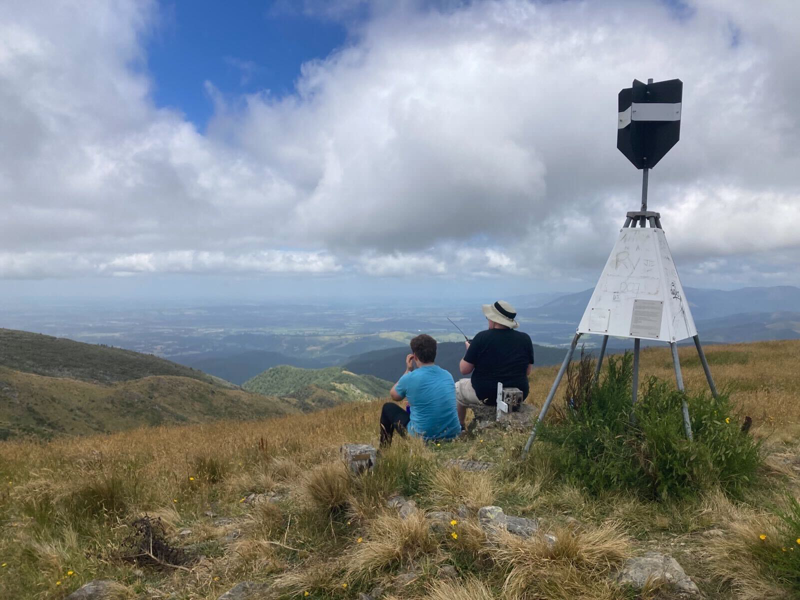

+++
author = "David Palmer"
title = "ZL3/CB-673 (Mt Grey) - My First SOTA Activation"
date = "2023-01-08"
description = "Making my first-ever SOTA activation from Mt Grey."
summary = "With one failed SOTA activation under my built, the itch to climb up a hill and make some contacts had been growing. Luckily, some of my friends were keen to hike up a mountain with me. One of them suggested Mt Grey as a reasonably easy starter peak to climb."
tags = [
    "radio",
    "baofeng",
    "field",
    "report",
    "sota",
]
thumbnail = "/images/mt-grey-pano.jpg"
+++
With one failed Summits on the Air activation under my built, the itch to climb up a hill and make some contacts had been growing. Luckily, some of my friends were keen to hike up a mountain with me. One of them suggested Mt Grey as a reasonably easy starter peak to climb.

## The Climb

I'm definitely not the fittest person, but I was fairly confident I could climb this mountain. The [Department of Conservation website](https://www.doc.govt.nz/parks-and-recreation/places-to-go/canterbury/places/mount-grey-maukatere-conservation-area/things-to-do/mt-grey-maukatere-tracks/) also allayed my fears of failure, with their description of the main track being "easy". Before we left, I did some research on previous SOTA activations, which let me in on the sort-of-secret shortcut track that leads up from Lake Janet. We debated taking that approach, but decided against it as the track is steeper and a bit less-well-maintained (though in hindsight I'm not so sure about that). Wasps can be a problem from January - March as they are attracted to the honeydew on the beech trees, however we had no run-ins with them.

The drive up was easy, but I'm glad we had a 4WD vehicle. I'm positive my family Honda would have really struggled with the road in some places. It had rained the day before, so the ground was still a little muddy in places. We parked up at the Grey River campsite, donned our packs and some sunscreen and began the hike.

The trail starts out fairly easy, wandering gently upwards through beech forest. At about only 20 minutes in, we hit our first hurdle. Blocking the track was an enormous fallen beech tree.[^1] The track was compeltely impassable. There was a clear route up the side of a steep muddy bank beside it that scramblers had made in their effort to go around. While it was very steep and not at all easy, we all made it up and over the bank without too much difficulty. We knew it would be less fun coming back down this on the return journey, but we left that challenge for when the time came.

The next part of the track was really very muddy. We were possibly the first group to come through it that day and so the ground wasn't churned up as badly as it would be later, and whilst relying heavily on my waterproof hiking boots we sloshed our way through the sludge. Good shoes or boots are really a must for this track I think - I definitely wouldn't tackle this in sneakers or trainers.

After the muddy bit the track begins the ascent proper, climbing steeply up the side of the ridge. There are a number of switchbacks on the way up that made the job a lot easier, but it certainly was a bit of slog. The forest is beautiful though - dense and very green with the sound of running water down below in the gully. At the top of the switchbacks, just below the treeline we crossed the stream and after a short while stepped out into open daylight. The remainder of the hike is up the side of a grassy ridge, with the microwave relay antenna above you. There are some amazing views out over the valley and the Canterbury foothills behind. 

The trig was in sight for the entire last part of the climb, and it just kept getting closer and closer, until we were suddenly at the top.

## Activating the Summit

I had already registered an alert on [SOTAWatch](https://sotawatch.sota.org.uk/). I keyed the Christchurch 705 repeater (which has a 1-second transmit tail on it), and heard the familiar click that told me the repeater was hearing me. I put out a call on the repeater to let people know I was switching to 146.500 simplex, and had some food. Very quickly Geoff ZL3QR came back to confirm I was up on the mountain, and to say he'd put out an alert for me on the repeater too. After that, the contacts just started rolling in!

Despite only using an 8W Baofeng handheld radio, I was getting very consistent 5-9 signal reports into Chirstchurch, Kaiapoi, Rangiora, Waipara and Loburn. The issues with QRM that I'd had up on Mt Pleasant and Sugarloaf weren't issues at all up Mt Grey, mostly because there isn't an FM transmitter up there. The contacts came so fast that one of my friends was nice enough to take over the responsibility of noting them down in my logbook so I could just concentrate on working the stations. All up I had 9 contacts over about half an hour. The furthest contact I got was to Paul ZL3HR down in Dunsandel, which is a distance of about 67km. Not bad for a small hand held! At that distance the signal was down at about a 5-3 to 5-5 for both of us. He'd initially come in on top of another stronger contact, and picking apart the pile-up proved to be a bit tricky - something I'll need some practice with! Branch 05 SOTA-guru Rick ZL3RIK was my second contact of the day, and he took the chance to invite me on his next SOTA outing on Bank's Peninsula later in the month.

Eventually the contacts tailed off, and after a bit of food and some unsuccessful Geocache-hunting we began the journey back down.

## The Return

On the way back down I stopped to collect another Geocache, but otherwise it was a fairly uneventful trip. One of my friends lost his footing and went over the side of the ridge, luckily landing in a tussock bush that safely broke his fall. The muddy parts further down had become much worse since we had left, as several other groups had followed us up to the top. When we reached the fallen tree near the bottom, I got about half-way down the scramble detour when I lost my footing a fell. Luckily I only dropped a few feet and didn't injure anything, but I did get a decent amount of mud all over myself and my pack!

We returned to the car tired, sore, muddy but energised. Hiking is something I really would like to do more of, and now that I can combine it with another hobby I'm sure I'll be doing much more of it in the future.

[^1]: The DoC website actually had a big red warning banner about this on the page for the track, but in doing my research I had somehow missed it. The warning claims that visitors will need some "agility, scrambling and bush bashing" skills to get through, which I guess I'll put on my CV for the future.